# IssabelRamal
    Implementação do Ramal Virtual no Issabel desempenha um papel fundamental na expansão das capacidades de comunicação do sistema.
    Este guia fornece uma orientação passo a passo para instalar e configurar eficientemente um ramal virtual, otimizando a operação do Issabel PBX

#INTRODUÇÃO; 
Nessa atividade iremos criar uma máquina virtual para a instalação do 
sistema operacional do issabel e configurar esse ambiente, após isso iremos 
acessar o issabel pelo browser e configurar dois ramais com isso deveremos baixar 
um software sip que consiga receber chamada e ligar, assim iremos baixar um 
software no celular por exemplo e configurar-lo desse jeito podendo ligar para o 
computador ou ao contrário.

1. INSTALAÇÃO DO AMBIENTE;
Realizando a instalação do ambiente virtualizado do ISSABEL, aqui iremos inserir o 
nome da VM(VIRTUAL MACHINE) a pasta de locação, ISO (IMAGEM DO 
SISTEMA) e o tipo do sistema

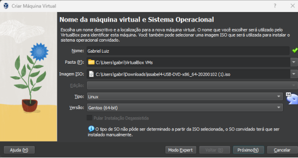

Nessa parte é para definir a quantidade de ram e cpu virtuais que deseja

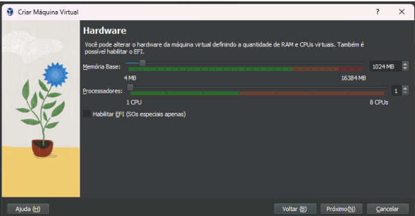

`Tamanho do disco;

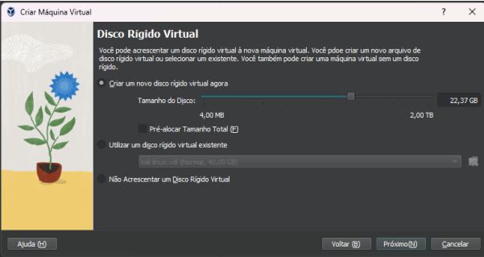
Depois de realizar a instalação da VM iremos colocar a rede dela no modo BRIDGE

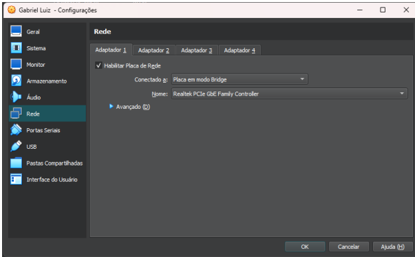

Logo após iremos iniciar a virtual machine e logo após iremos instalar a imagem 
ISSABEL;

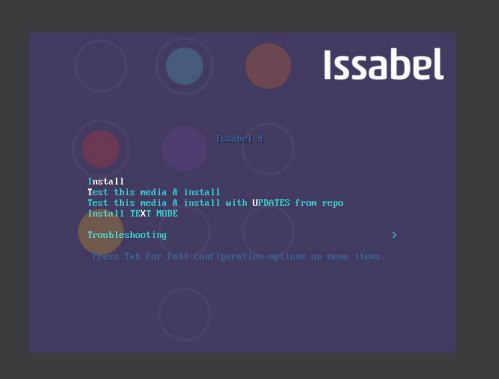
Seleciona o idioma da instalação:
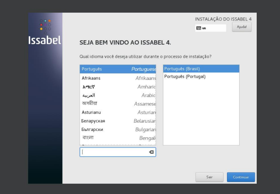

Nessa parte do resumo de instalação a menus obrigatórios a ser configurados.

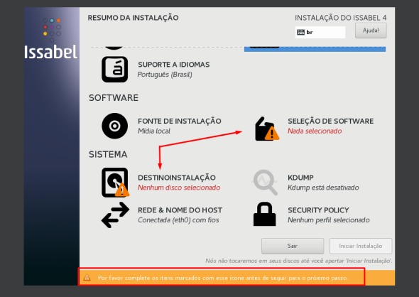

Seleção de software;

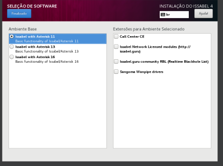

Seleção de destinação da instalação;

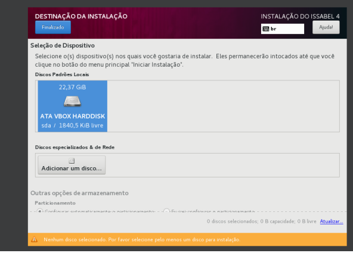

Aqui iremos selecionar para configurar a senha raiz ou a criação de usuário:

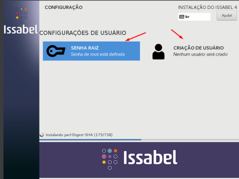

Configuração de senha;

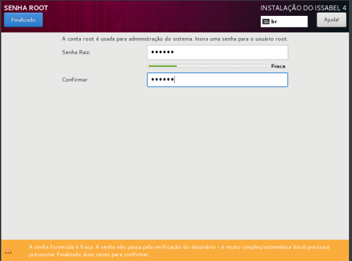

Logo após você irá colocar uma nova senha;

Depois uma senha para o IssabelPBX (admin)

Nessa parte é para realizar o login com o usuário root e sua senha com isso você irá 
obter o IP do issabel;

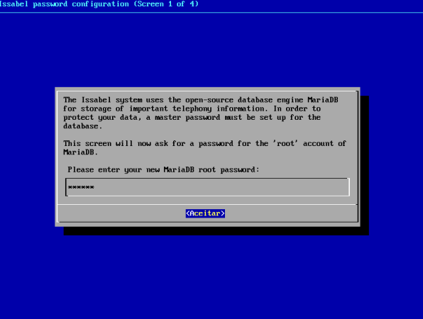

2. CONFIGURAÇÃO;

Logo após obter o IP do Issabel, você irá colocar o ip no browser e pesquisar, vai 
entrar no site da issabel e nisso você irá entrar com o usuário admin e sua senha.

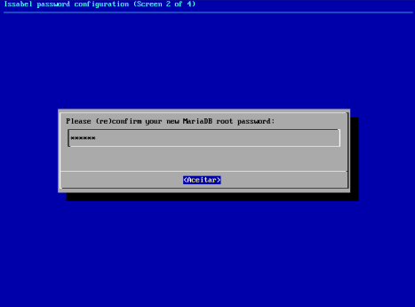

Nisso irá abrir o site da issabel.

Vamos configurar o PABX começando indo pelo PABX configuration logo após add 
extension e depois submit

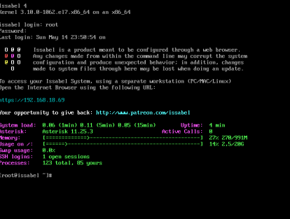

Configuração do primeiro ramal:

Logo após ir em submit e depois em apply changes;

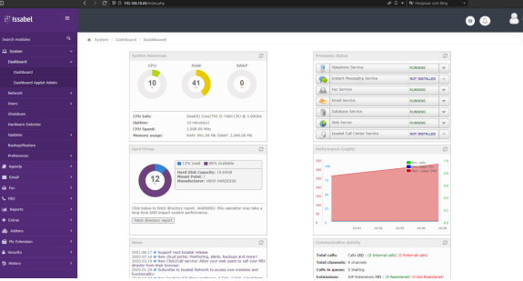

Depois iremos criar o segundo ramal

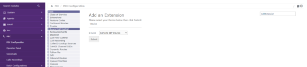

No dashboard mostra os dois ramais não registrados;

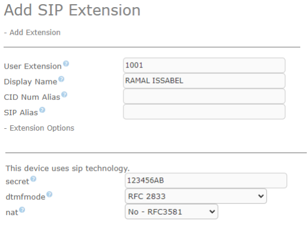

3. Ambiente em funcionamento;
Configuração do Microsip;

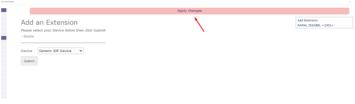

Ligando para o celular;

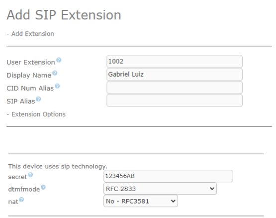

Chamada no celular;

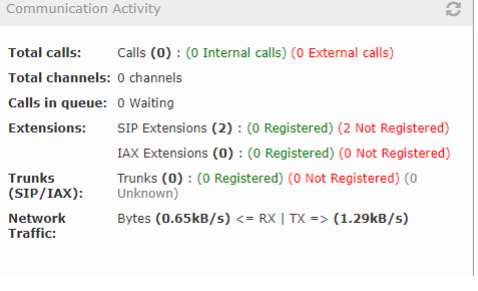

3CX SOFTPHONE;

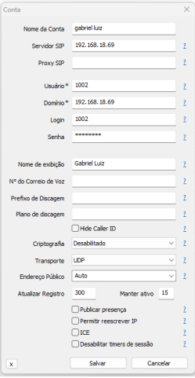

CELULAR;

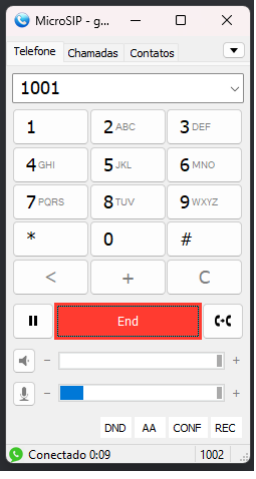

OBS: A configuração do ramal no celular pelo sipdroid é o mesmo porém só altera o número. 

